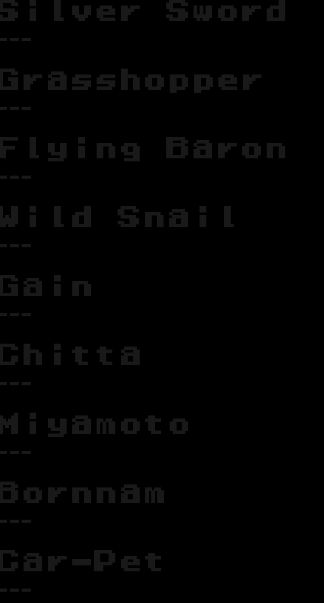

# Armed Police Batrider OBS Browser Source Scoretable
 A simple score table implemented in HTML and CSS as a dynamic OBS Browser Source element.

This is a super simple implementation of a multi-page score table showing scores and clear progression for all 18 characters in Armed Police Batrider, designed for use as a stream overlay element. It was originally created c. September 2020 for use in streams by [Pearl](https://www.twitch.tv/pearl_) on his quest to clear Batrider with all ships and get at least one no-miss ALL.

Scores can be entered and split into pages. Each page will animate in, persist for a certain amount of time, then animate out and advance to the next page.

Though this is purpose-built for Armed Police Batrider at present, it could easily be adapted to cover other games. In the future, I'd like to expand it to be a bit easier to customize and style; I think as a fundamental platform it could work well for many different games across many genres.

-----

#### Usage

To use, point to this file with a Browser Source in OBS and configure the Browser Source size as desired. You may need to adjust the `<body>` element font-size in the CSS; all font size and text spacing is relative to it (implemented using `rem`).

The default animation mode is to slide in scores from the right edge, so be sure to specify the width of the Browser Source to match your layout requirements!

You should not need to make any adjustments to OBS Browser Source CSS settings; the default option will make the background transparent (instead of black), for easier integration into layouts.

Animation timings, items per page, and score contents can be modified in the Javascript section of the `index.html` file. Everything is declared inline (JS/CSS/HTML all in one file), because of the simplicity of the implementation and a desire to avoid CORS errors (during testing, I noticed having an external Javascript file included could cause issues when loading the file locally in Chrome - still investigating fixes for that without requiring the user to host a webserver).

#### Known Limitations

- All score entries must be manually edited and will not update in real-time without a refresh
- Scores are stored inline, as opposed to in an external `txt` or `csv` file. In future iterations I'd like to be able to read score data from plaintext, since it is more user-friendly
- Scores are currently in string format. This works very well for Batrider and other YGW games because of letter scoring, but may not scale to all games. It requires extra care from users to respect normal digit format conventions (comma/period/etc)
- Having all implementation inline makes it a bit messy to read and edit
- Animation timings can desync in some situations if a browser load 'stutters' during a page swap; this can result in the page failing to render until the page is refreshed
